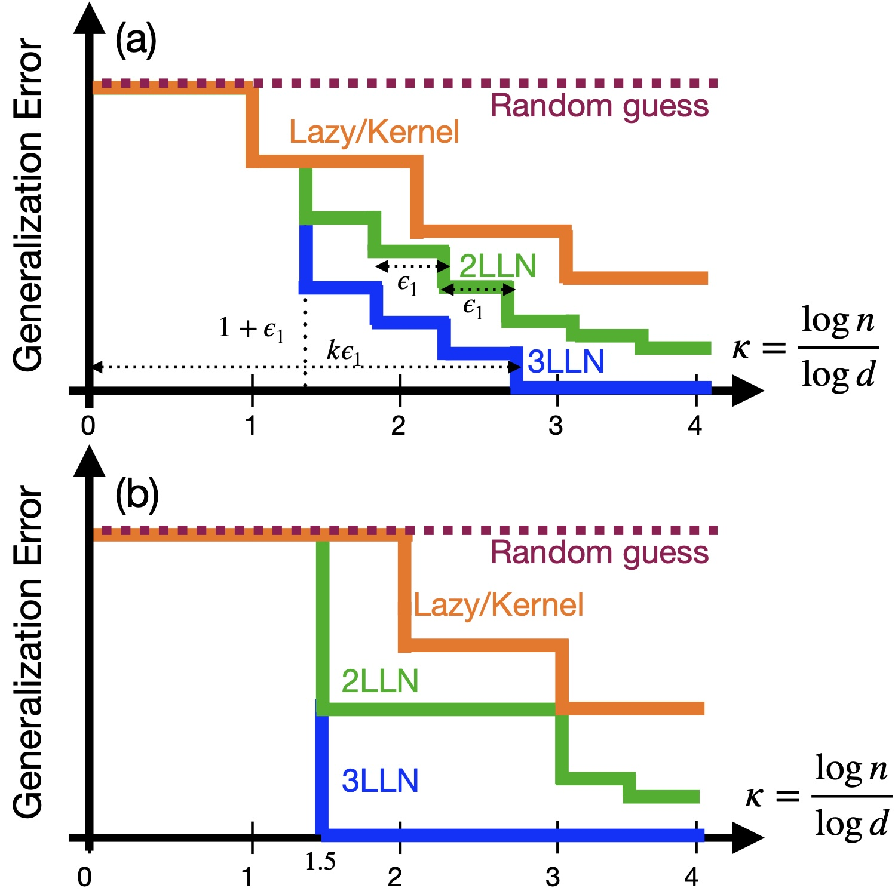

# ComputationalDepth

This repository contains the code for the paper "The Computational Advantage of Depth: Learning High-Dimensional Hierarchical Functions with Gradient Descent" [arXiv:2502.13961](https://arxiv.org/abs/2502.13961). 

The requirements to run the code are contained in the `requirements.txt` file.  

The code is organized as follows:
- `Codes/RawHyperparams/` contains the hyperparameters file (*Setting.yaml*). The user can set it by replacing "..." with the wanted values (See the Example folder for a prototype). The user can run the script `Codes/genYaml.py` to generate the definitive *.yaml* file to be used in the experiment. 
- `Codes/RunExperiment.py` contains the code to run the experiments. For convenience, we grouped everything in a single script containing both the lazy/shallow methods and the multi-layer methods and some useful functions and classes are in `Codes/utils.py`. The results are saved in the `Codes/data/` folder.
- According to the different metric to analyze, the codes to generate the plots are: `Codes/ErrorPlotting.py` and `Codes/OverlapPlotting.py`.
